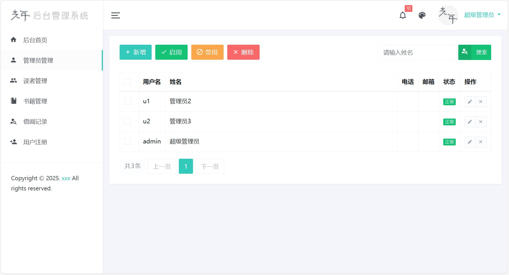

# 图书管理系统 V1.0

#### 介绍
这是一个基于JSP + MySQL + Servlet (Jakarta) 的图书管理系统。

实现了 管理员，读者，游客 三种角色的权限控制

管理员对读者、图书、借阅的信息进行增删查改。

读者可以查询图书信息，查询借阅信息。

游客只能浏览图书信息，需要注册登录。

#### 软件架构

Jakarta.Servlet + Maven + JSP + MySQL + JQuery(AJAX) + Bootstrap4(LightYear 光年 UI库) + Tomcat(10.x)

#### 安装教程

1. 找到项目里面的SQL文件，然后在MySQL中创建一个数据库，名字为 library，编码为utf-8，把sql文件导入到创建好的数据库。

2. 数据弄好后等 maven 下载依赖

3. 修改配置文件，把数据库连接信息改成自己的 （JdbcUtils.java）

4. 配置 Tomcat 服务器，把项目部署到服务器上。启动有问题就重新配置一下 Modules 和 Artifact。 

#### 已实现功能
    
1. 分角色登录（管理员，读者，游客）

首页：

2. 注册

3. 

3. 图书查询与管理

4. 

4. 借阅信息查询与管理

添加借阅信息： 

 
根据读者或图书查询借阅记录：

5. 用户查询与管理

6. 分页与搜索

7. 用户信息修改

8. 密码修改
 

9. 验证码生成与验证

10. 头像图片上传

#### 待完成的功能

1. 批量删除数据
 
2. 归还图书提醒（右上角小铃铛提醒）

3. 密码加密

4. 显示全部记录与未归还记录

5. 图书类型管理（增加类型表，类型管理界面）
 
6. 图书详情页（展示图片）

7. 查询数据导出excel文件

... ... 还有很多功能可以补充